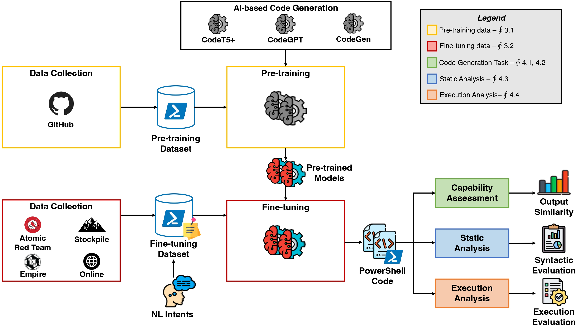



# PowerShell-offensive-code-generation



This repo provides a replication package for the paper  "**The Power of Words: Generating PowerShell Attacks from Natural Language**". The paper has been accepted for publication at the 18th USENIX WOOT Conference on Offensive Technologies (WOOT 2024). This paper is also available on [arXiv](https://arxiv.org/abs/2404.12893)

In this paper, we present an extensive evaluation of state-of-the-art NMT models in generating PowerShell offensive commands. 

We also contribute with a large collection of unlabeled samples of general-purpose PowerShell code to pre-train NMT models to refine their capabilities to comprehend and generate PowerShell code. Then we build a manually annotated labelled dataset consisting of PowerShell code samples specifically crafted for security applications which we pair with curated Natural language descriptions in English.

We use this dataset to pre-train and fine-tune:

- [CodeT5+](https://huggingface.co/Salesforce/codet5p-220m)
- [CodeGPT](https://huggingface.co/microsoft/CodeGPT-small-py)
- [CodeGen](https://huggingface.co/Salesforce/codegen-350M-mono)

We also evaluate the model with:

- Static Analysis in which the generated code is assessed to ensure that it adheres to PowerShell programming conventions
- Execution Analysis which evaluates the capabilities of the generated offensive PowerShell code in executing malicious action

The project includes scripts and data to repeat the training/testing experiments and replicate evaluations.

## Citation

```
@misc{liguori2024power,
    title={The Power of Words: Generating PowerShell Attacks from Natural Language},
    author={Pietro Liguori and Christian Marescalco and Roberto Natella and Vittorio Orbinato and Luciano Pianese},
    year={2024},
    eprint={2404.12893},
    archivePrefix={arXiv},
    primaryClass={cs.CR}
}
```

## Project Organization

The diagram below provides the organization of the project:

```
├── notebooks
│   ├── 00-dataset
│   ├── 01-pre-training
│   │   ├── CodeGen
│   │   ├── CodeGPT
│   │   ├── CodeT5p
│   │   └── dataset
│   ├── 02-fine-tuning
│   │   ├── finetuning.ipynb
│   │   ├── json
│   │   └── model
├── pwsh-execution-analysis
├── pwsh-syntax-analysis
└── text-to-code
```

In which:

- The `notebooks` folder contains all the codes for the pre-training and fine-tuning operation
- The `pwsh-execution-analysis` contains the scripts and configurations for analyzing PowerShell execution on Windows systems
- The `pwsh-syntax-analysis` contains all the script needed for the Static analysis of the generated code
- `Text-to-code` forked from [CodeXGLUE](https://github.com/microsoft/CodeXGLUE) is a framework used for the fine-tuning operation

> We also provided a repository with scripts to help with inference and training. Find it at https://github.com/dessertlab/powershell-offensive-code-generation-Artifact.

## Installation Steps

### Install the dependencies

```
cd powershell-offensive-code-generation/
pip install -r requirements.txt
```
